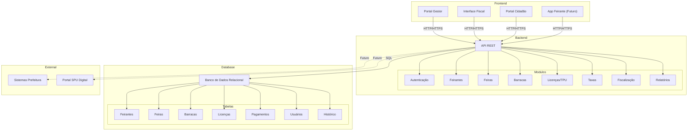

# Arquitetura de Componentes - Sistema de Gestão de Feiras Livres

## Diagrama em Mermaid

## Descrição da Arquitetura

### Camada de Apresentação (Frontend)

- **Portal Gestor**: Gestão completa das feiras, feirantes e licenças
- **Interface Fiscal**: Consultas e fiscalização em campo
- **Portal Cidadão**: Consulta pública de feiras e feirantes
- **App Feirante**: Futura aplicação para feirantes acompanharem suas licenças

### Camada de Negócio (Backend)

Uma **API REST** organizada em **8 módulos** principais:

1. **Autenticação**: Segurança e controle de acesso
2. **Feirantes**: Gestão de cadastros e dados pessoais
3. **Feiras**: Gestão de feiras por bairro e horário
4. **Barracas**: Registro e alocação de barracas
5. **Licenças/TPU**: Solicitação e aprovação de autorizações
6. **Taxas**: Controle de pagamentos e débitos
7. **Fiscalização**: Ferramentas para fiscais
8. **Relatórios**: Geração de relatórios administrativos

### Camada de Persistência (Banco de Dados)

Banco de dados relacional com **7 tabelas principais**:

- Feirantes, Feiras, Barracas, Licenças, Pagamentos, Usuários, Histórico

### Integrações Futuras

- Sistemas da Prefeitura de Fortaleza
- Portal SPU Digital para gestão de patrimônio público
