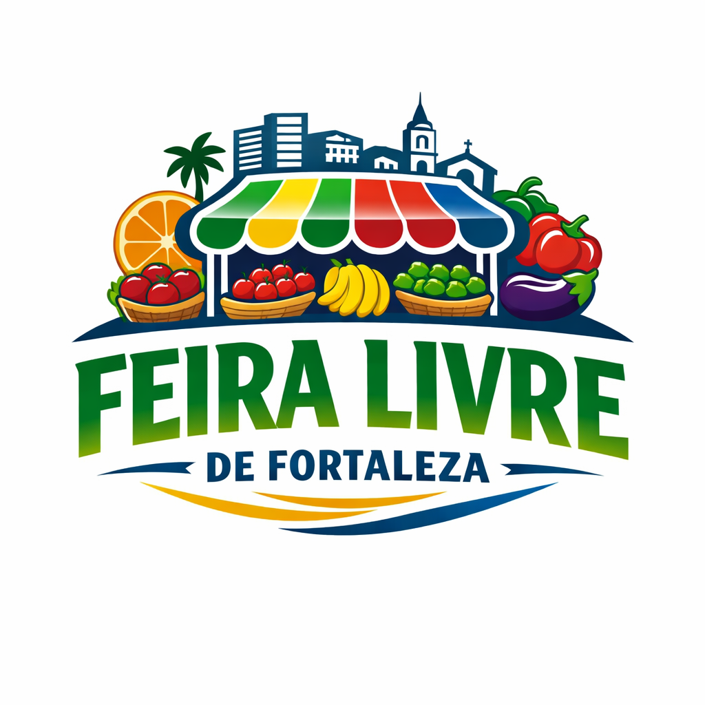
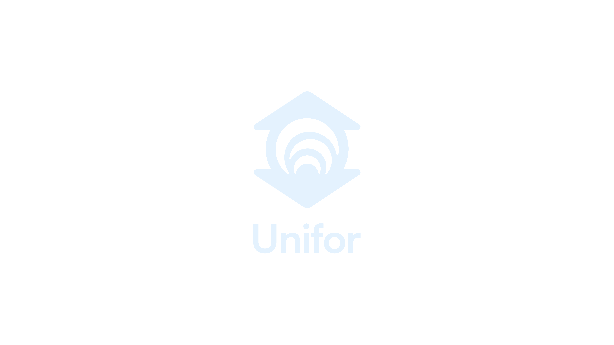

# Instruções para os Logos

## Localização das Imagens

O arquivo `pitch.html` espera encontrar os logos em:
```
assets/images/logo-feira-livre.png
assets/images/logo-unifor.png
```

## Como Adicionar os Logos

1. **Salve a imagem do logo Feira Livre** como `logo-feira-livre.png` na pasta `assets/images/`
   - Exibido no topo do pitch
   
2. **Salve a imagem do logo Unifor** como `logo-unifor.png` na pasta `assets/images/`
   - Exibido no footer, lado esquerdo

## Alternativa: Usar URLs Externas

Se preferir usar URLs externas, edite as linhas no `pitch.html`:

**Para Feira Livre:**
```html

```
Substitua por:
```html

```

**Para Unifor:**
```html

```
Substitua por:
```html

```

## Requisitos de Imagem

### Logo Feira Livre
- **Formato:** PNG, JPG ou SVG
- **Tamanho recomendado:** 1200x800px ou superior
- **Proporção:** Paisagem (horizontal)
- **Fundo:** Transparente (para PNG) ou branco
- **Será redimensionado para:** máximo 350px de largura

### Logo Unifor
- **Formato:** PNG, JPG ou SVG
- **Tamanho recomendado:** 400x400px ou superior
- **Proporção:** Quadrada ou vertical
- **Fundo:** Transparente (para PNG) ou branco
- **Será redimensionado para:** máximo 150px de altura

