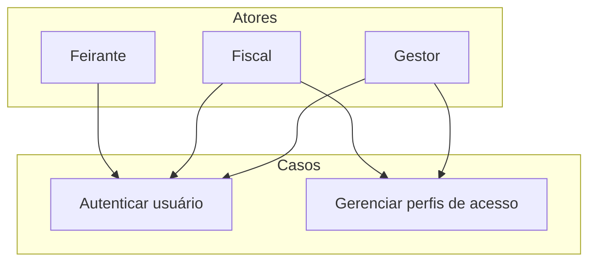

# Acesso e segurança

Este diretório contém os casos de uso relacionados à autenticação de usuários e ao gerenciamento de perfis de acesso.

## Diagrama de Casos de Uso

## Casos de Uso

- `Autenticar usuário`
- `Gerenciar perfis de acesso`
