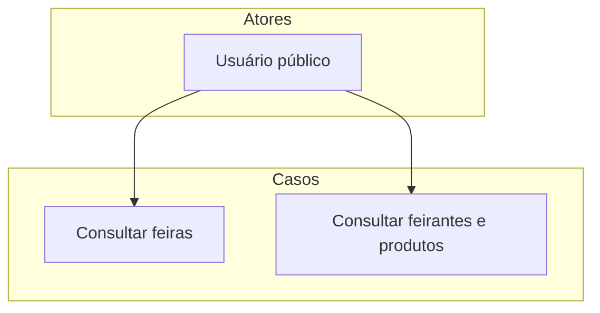

# Consulta pública

Este diretório contém os casos de uso para consultas públicas de feiras, feirantes e produtos.

## Diagrama de Casos de Uso

## Casos de Uso

- `Consultar feiras`
- `Consultar feirantes e produtos`
