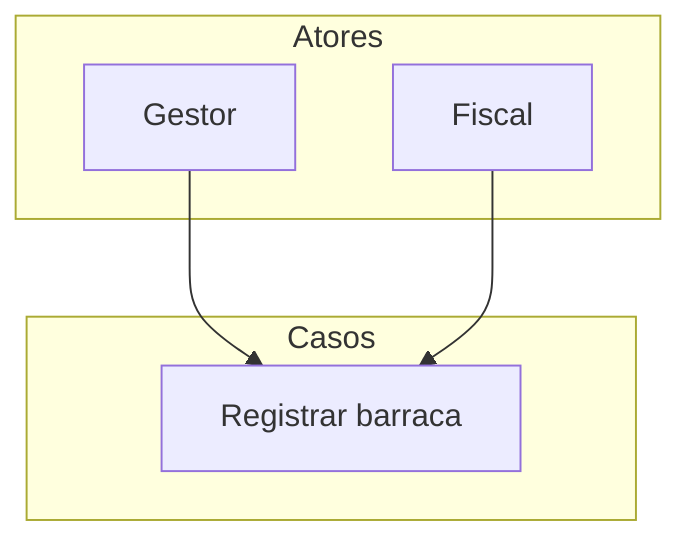

# Controle de barracas

Este diretório contém os casos de uso para registro e controle de barracas nas feiras.

## Diagrama de Casos de Uso

```mermaid
graph TB
    subgraph Atores
        Gestor["Gestor"]
        Fiscal["Fiscal"]
    end

    subgraph Casos
        Registrar["Registrar barraca"]
    end

    Gestor --> Registrar
    Fiscal --> Registrar
```

## Casos de Uso

- `Registrar barraca`
