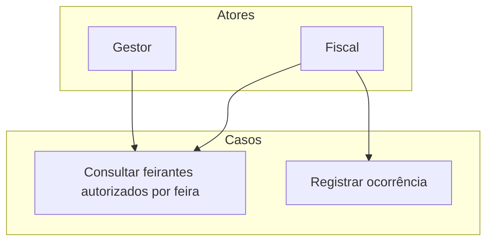

# Fiscalização

Este diretório contém os casos de uso para fiscalização, verificação de autorizações e registro de ocorrências.

## Diagrama de Casos de Uso

## Casos de Uso

- `Consultar feirantes autorizados por feira`
- `Registrar ocorrência`
