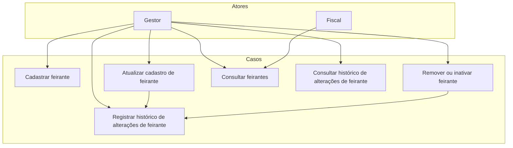

# Gerenciar cadastro de feirantes

Este diretório contém os casos de uso relacionados ao gerenciamento de feirantes, incluindo cadastro, atualização, remoção/inativação, consulta e histórico de alterações.

## Diagrama de Casos de Uso

## Casos de Uso Incluídos

- `Cadastrar feirante`
- `Atualizar cadastro de feirante`
- `Remover ou inativar feirante`
- `Consultar feirantes`
- `Registrar histórico de alterações de feirante`
- `Consultar histórico de alterações de feirante`
