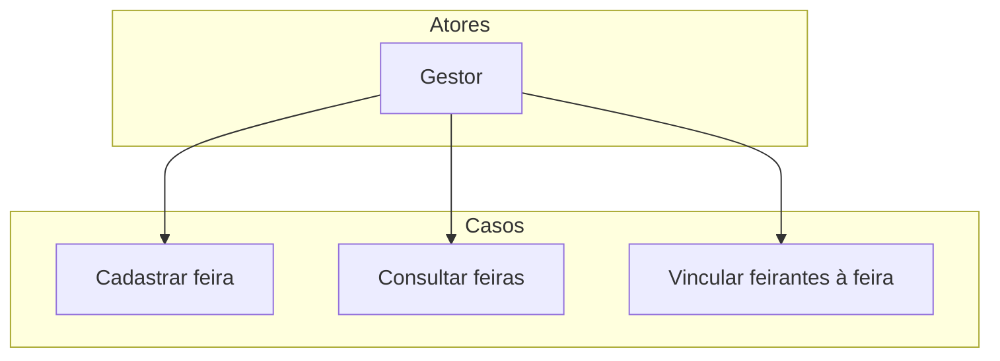

# Gerenciar feiras

Este diretório contém os casos de uso para criação, consulta e vinculação de feirantes às feiras.

## Diagrama de Casos de Uso

## Casos de Uso

- `Cadastrar feira`
- `Consultar feiras`
- `Vincular feirantes à feira`
