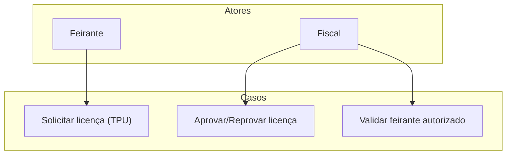

# Gestão de licenças

Este diretório contém os casos de uso para solicitar, aprovar e validar licenças de feirantes.

## Diagrama de Casos de Uso

## Casos de Uso

- `Solicitar licença (TPU)` 
- `Aprovar/Reprovar licença`
- `Validar feirante autorizado`
