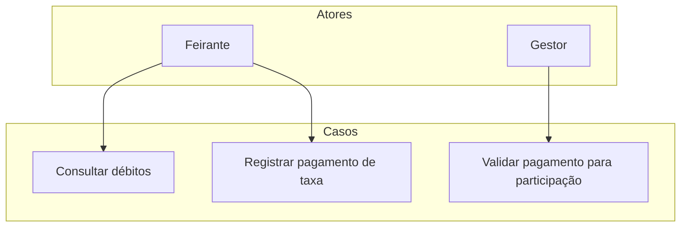

# Gestão de taxas

Este diretório contém os casos de uso para consulta e pagamento de taxas, além da validação de participação.

## Diagrama de Casos de Uso

## Casos de Uso

- `Consultar débitos`
- `Registrar pagamento de taxa`
- `Validar pagamento para participação`
