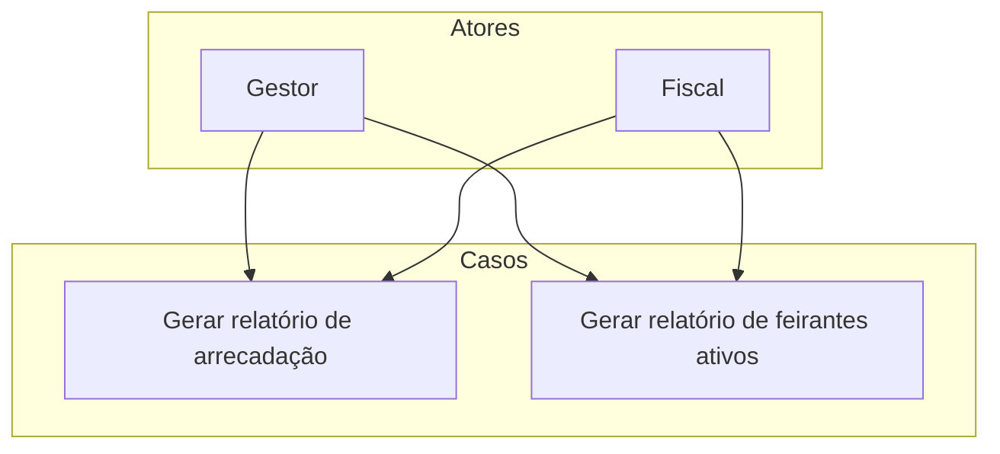

# Relatórios

Este diretório contém os casos de uso para geração de relatórios de arrecadação e de feirantes ativos.

## Diagrama de Casos de Uso

## Casos de Uso

- `Gerar relatório de arrecadação`
- `Gerar relatório de feirantes ativos`
